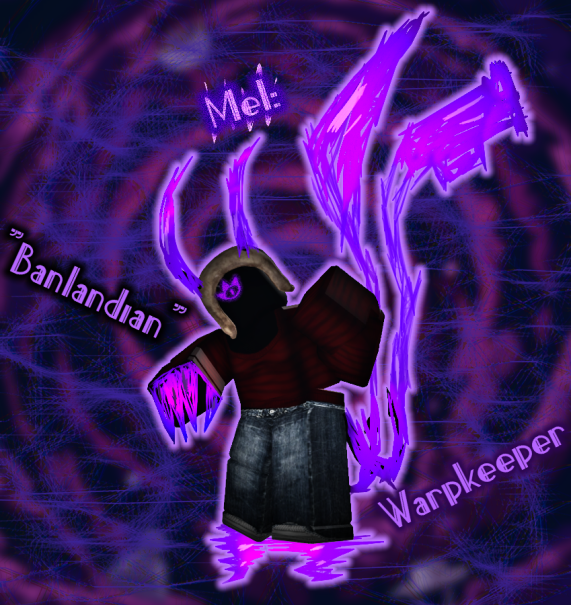
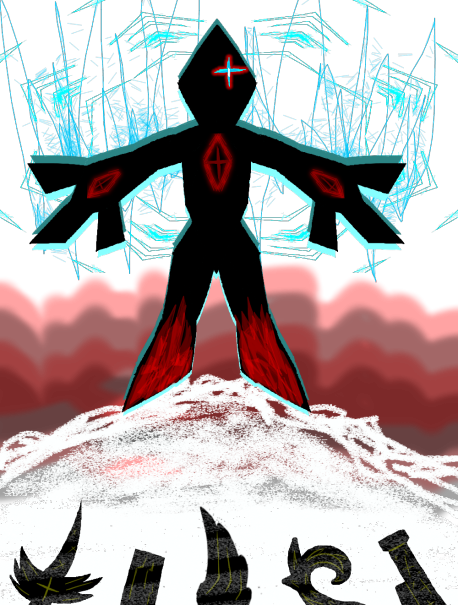
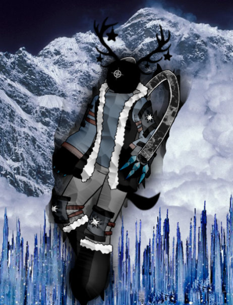
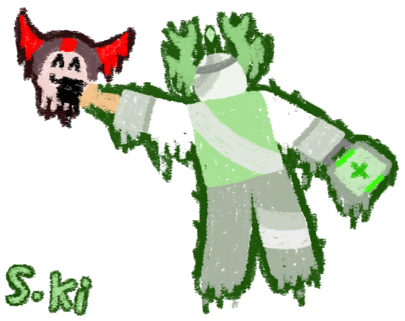

# Team "All or Nothing"

We try to persevere even when stress and anxiety mounts. We can do it!

## TM1 - Xaviere Hanbury

**Likes:** Roleplaying, rainy days, night time. 
**Dislikes:** Bright lights, mornings, humid days.
**From:** London, ON, Canada.
**Hobbies:** Drawing/editing, storycrafting, playing assorted video games.
**Skills:** Writing, drawing, creative work.

## TM2 - Alex Kister

**Likes:** Reading, sharing stories, ice skating.
**Dislikes:** The cold, hot cocoa, noisy people.
**From:** London, ON, Canada.
**Hobbies:** Sports, fencing, and talent shows.
**Skills:** Coding, design, and artistry.

## How to Commit
**1. Fork the repo!**
**2. Create your feature branch: git checkout -b my-new-feature**
**3. Commit your changes: git commit -am 'Add some feature'**
**4. Push to the branch: git push origin my-new-feature**
**5. Submit a pull request to us!**

## History:
TODO: Write History

## Credits:
TODO: Write Credits

## License:
TODO: Write License

